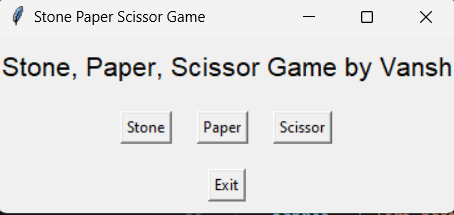
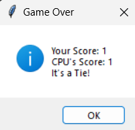

# Stone, Paper, Scissors Game

Welcome to the Stone, Paper, Scissors game! Play against the CPU and see if you can outwit it in this classic game of chance and strategy. Choose between Stone, Paper, or Scissor and see how you fare!

## Project Overview

This project includes two versions of the game:

- **Command-Line Interface (CLI) Version**: A basic text-based version of the game.
- **Graphical User Interface (GUI) Version**: An enhanced version with a user-friendly graphical interface.

## Files

1. **`Stone,Paper,Scissor.py`**: CLI version of the Stone, Paper, Scissors game.
2. **`gui_version.py`**: GUI version of the Stone, Paper, Scissors game using Tkinter.

## Dependencies

For the GUI version, ensure you have the Tkinter package installed. Tkinter is included with standard Python installations, so you generally won't need to install it separately.

## Usage

### CLI Version

To use the CLI version:

1. Open a terminal or command prompt.
2. Navigate to the directory containing `Stone,Paper,Scissor.py`.
3. Run the script with:

    ```bash
    python Stone,Paper,Scissor.py
    ```

4. Follow the on-screen prompts to play the game.

### GUI Version

To use the GUI version:

1. Open a terminal or command prompt.
2. Navigate to the directory containing `gui_version.py`.
3. Run the script with:

    ```bash
    python gui_version.py
    ```

4. A window will open where you can choose Stone, Paper, or Scissor by clicking the corresponding buttons.

## Game Instructions

- **Stone**: Click the "Stone" button to choose Stone.
- **Paper**: Click the "Paper" button to choose Paper.
- **Scissor**: Click the "Scissor" button to choose Scissor.
- **Exit**: Click the "Exit" button to close the application and view the final scores.

## Features

- **CLI Version**:
  - Text-based interface.
  - Basic game logic with score tracking.
  
- **GUI Version**:
  - User-friendly graphical interface with buttons for choices.
  - Real-time feedback with pop-up messages for game results.
  - Final score display on exit.

## Screenshots



## Contributing

Feel free to fork the repository and make your improvements! If you have any ideas for new features or enhancements, please open an issue or submit a pull request.

## License

This project is licensed under the MIT License. See the [LICENSE](LICENSE) file for details.

## Acknowledgements

- Thanks to the Tkinter library for providing a straightforward way to build GUIs in Python.

---

## 📞Contact

For any questions or feedback, please contact [vansh-codes](https://github.com/vansh-codes).

### - Created by **Vansh Chaurasiya** 
Show some ❤️ by starring this repository !


## 🔗Links
[](https://www.linkedin.com/in/vanshchaurasiya24)
[](https://www.twitter.com/vanshchaurasiy4) <p align="right"><a href="#top">BACK TO TOP</a></p>